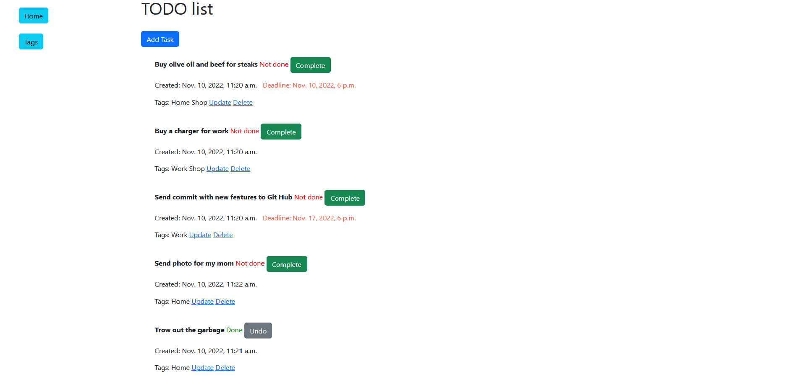
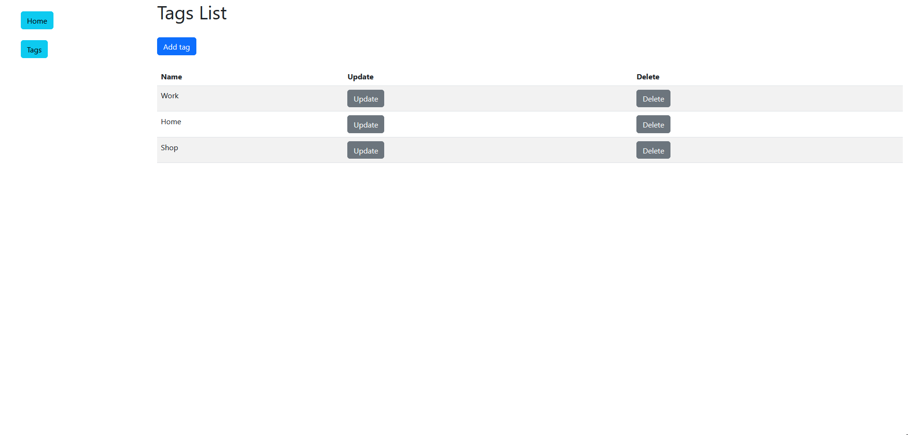

# My ToDo List 

Django project for managing your tasks

## Features

* Easy to use
* Ability to create new tasks or update old tasks
* Ability add tags to your tasks

## Installation
Python3 must be already installed

```shell
git clone https://github.com/yaroslav-demchenko/todo-list-app
cd todo-list-app
python3 -m venv venv
source venv/bin/activate
pip install -r requirements.txt
python manage.py migrate
python manage.py runserver # starts Django server
```


## Demo



